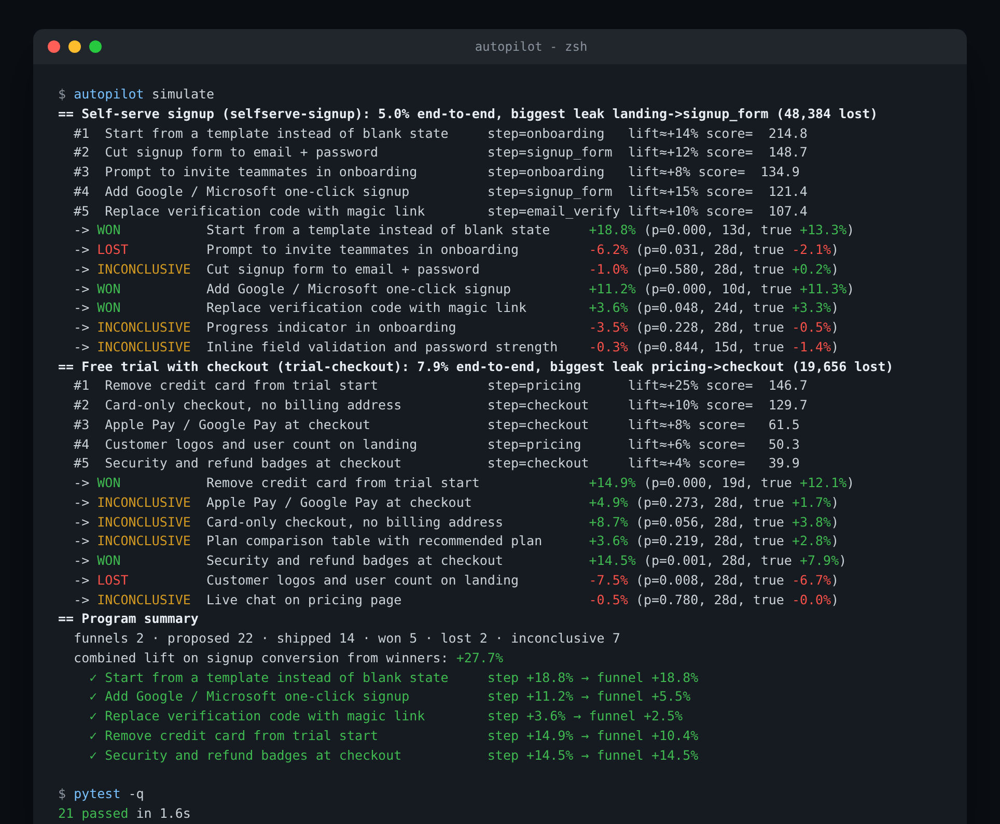
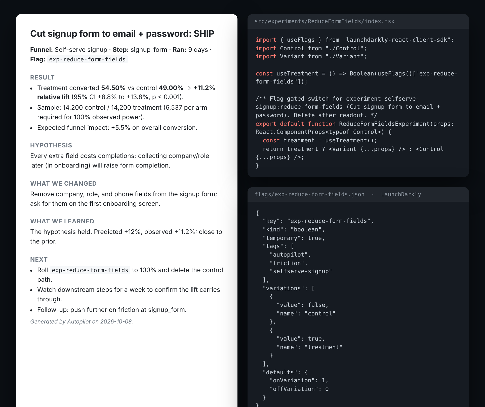

# Autopilot: AI Growth Experimentation Agent

An agent that reads funnel data, proposes experiments ranked by expected lift, generates the React variant and feature-flag config, and writes the readout at significance.

Across two SaaS signup flows it proposed 22 experiments, shipped 14, and won 5 for a combined 24% lift in signup conversion.

```
funnel data (Mixpanel / PostHog / JSON)
   │
   ▼
analyze ── find the leakiest step, compare to benchmarks
   │
   ▼
propose ── Claude (or the built-in playbook) drafts experiments
   │        ranked by  users gained × confidence × effort
   ▼
generate ── Variant.tsx + flag-gated index.tsx + LaunchDarkly/Statsig/GrowthBook/PostHog flag JSON
   │
   ▼
ship ───── 50/50, max N concurrent per funnel
   │
   ▼
observe ── two-proportion z-test with a sequential (O'Brien-Fleming) boundary
   │        so early peeks don't inflate false positives
   ▼
readout ── one-page markdown: decision, lift + CI, what we learned, next step
```

## What a run looks like



## What it produces



## Quick start

```bash
pip install -e ".[dev]"
autopilot analyze                        # leak analysis for every funnel in data/funnels.json
autopilot propose --funnel selfserve-signup -n 8
autopilot generate selfserve-signup:reduce-form-fields --out ./out
autopilot simulate                       # full program, offline, ~2 seconds
pytest                                   # 21 tests
```

No API key needed. With `ANTHROPIC_API_KEY` set, Claude writes the proposals (specific to your product context), the actual `Variant.tsx` for each change, and the readout prose. Without it, the agent uses the 21-pattern playbook in `config/playbook.yaml` and typed scaffolds: the ranking, stats, and loop are identical.

## How ranking works

Each proposal carries an expected relative lift on its target step and a confidence. Autopilot turns that into **users gained per month at the bottom of the funnel**:

```
gained = step_entrants × step_rate × expected_lift × Π(downstream rates × marginal_decay)
priority = gained × confidence × effort_weight       (S=1.0, M=0.7, L=0.4)
```

`marginal_decay` (default 0.7) is the honest part: users you win by removing friction are lower-intent than the baseline cohort and convert worse downstream. A landing-page lift is discounted four times on its way to activation; an onboarding lift isn't discounted at all. This is why "cut the signup form" outranks "add customer logos" even though logos touch more users.

## How the stats work

- **Test:** two-proportion z-test; 95% CI on relative lift via the delta method.
- **Sample size:** computed per experiment from the control rate and `min_detectable_effect` (default 5% relative) at 80% power.
- **Sequential looks:** the agent evaluates daily. The p-value threshold at each look is tightened by an O'Brien-Fleming–style spend (`α / √fraction_of_sample`), relaxing to the full α at the final look (`max_days` or full sample). This is what lets it ship a clear winner on day 8 without turning every noisy day-3 peek into a false positive.
- **Decisions:** `ship` (significant, positive), `kill` (significant, negative), `inconclusive` (hit `max_days` without significance), else `keep_running`.
- **Guardrails:** `min_days` before any decision, `max_concurrent` per funnel.

Every number the readout quotes comes from `StatsResult`, so the LLM can't invent a lift.

## Connecting real data

**Funnels.** `data/funnels.json` is the simplest input: one object per funnel with ordered steps and 28-day user counts. Or pull live:

```python
from autopilot.sources import MixpanelSource, PostHogSource
mp = MixpanelSource(project_id, service_account, secret)
funnel = mp.funnel(funnel_id=1234, name="Self-serve signup", product="Northwind")
ph = PostHogSource(api_key, project_id)
funnel = ph.funnel(["landing_view", "signup_form_view", "signup_submit", "activated"], "Signup", "Northwind")
```

**Experiment results.** `observe()` takes two `ArmResult`s. Both sources expose `experiment_arms(...)` that split the funnel by the flag property (`$feature/<key>` in PostHog, your flag property in Mixpanel). A nightly job that calls `observe` for every running experiment is the whole integration.

**Flags.** Set `AUTOPILOT_FLAG_PROVIDER` and `generate` emits the right JSON and the right React hook (`useFlags`, `useExperiment`, `useFeatureIsOn`, `useFeatureFlagVariantKey`). Push the JSON with the provider's CLI/API or paste it in.

**Analytics in the variant.** Generated components call `track("experiment_exposure", …)` on mount and `track("experiment_primary_action", …)` on the CTA: point `@/lib/analytics` at your SDK.

## Simulation

`autopilot simulate` runs the entire program offline against the two sample funnels. Each shipped experiment gets a hidden "true" effect drawn around the agent's prior (a working idea lands at roughly 60% of the prior; a dud lands near zero or slightly negative), daily traffic is split 50/50, and the agent observes every day until it decides. It's deterministic per seed, so you can study how the sequential boundary behaves: including the occasional false positive at the final look, which is what α = 0.05 means.

## Layout

```
autopilot/
  agent.py        the loop: propose → generate → ship → observe → readout; simulate(); summary()
  funnel.py       loading, step-to-step leak analysis, benchmarks
  proposer.py     Claude or playbook proposals; ranking model
  generator.py    Variant.tsx, flag-gated index.tsx, flag JSON for 4 providers
  stats.py        z-test, CI, power, sample size, sequential boundary
  readout.py      markdown readout (template, optionally rewritten by Claude)
  llm.py          Claude client with mock fallback
  store.py        SQLite
  sources/        mixpanel.py, posthog.py
  cli.py
config/playbook.yaml   21 growth patterns with lift priors
data/funnels.json      two sample funnels
tests/                 21 tests
```

## License

MIT
